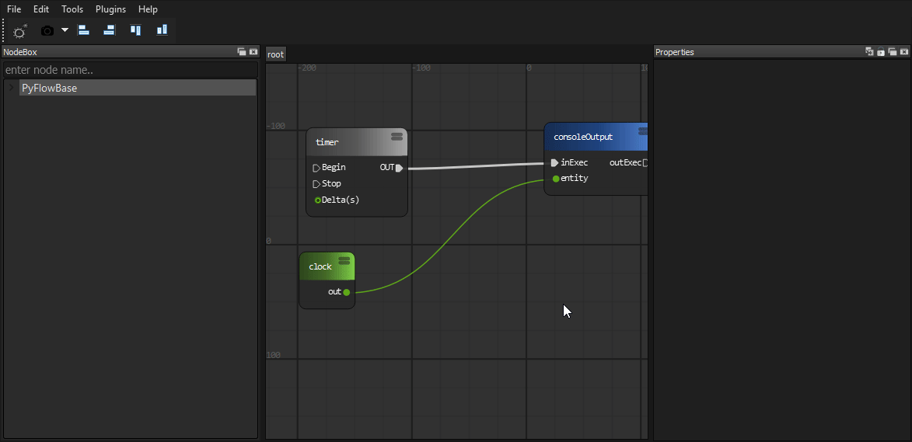
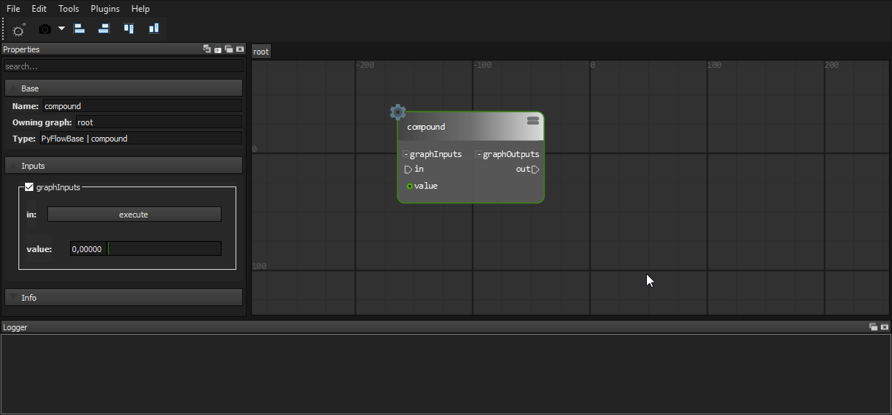
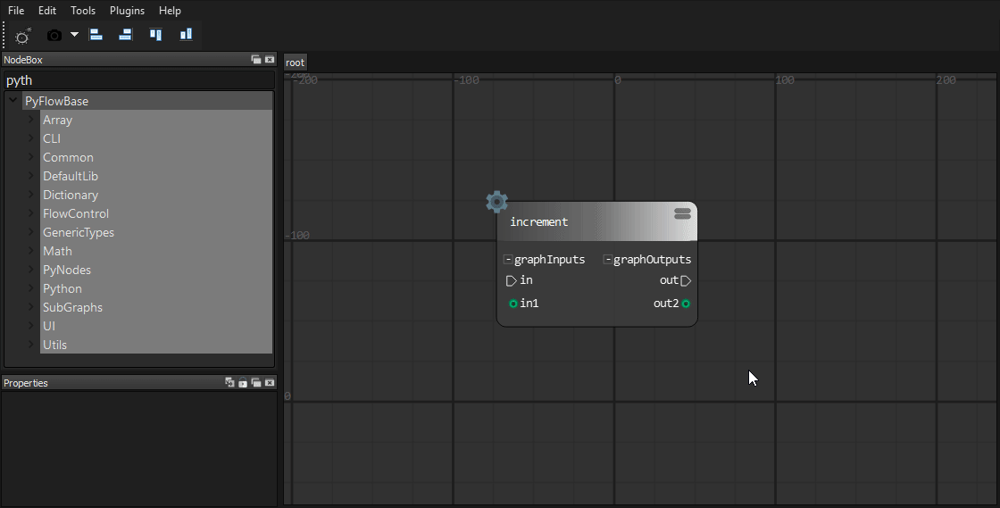
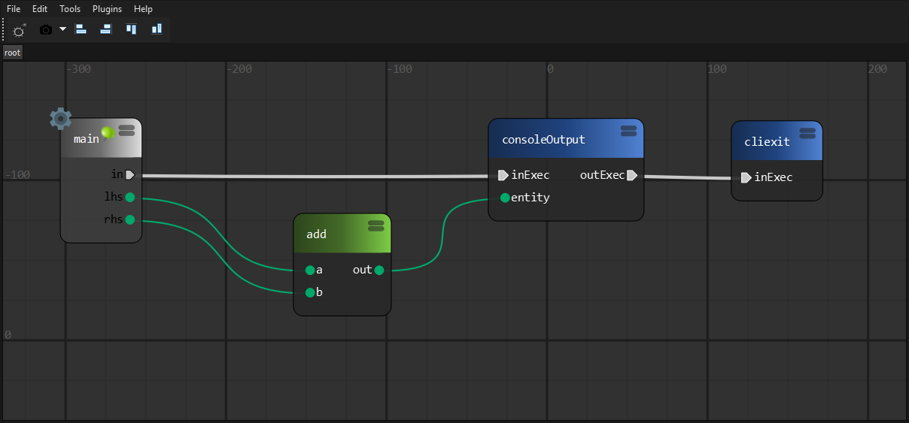
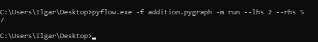
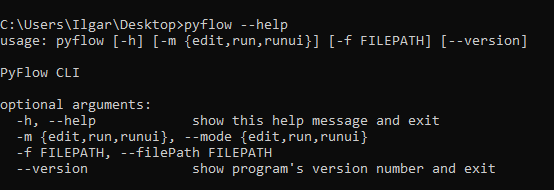
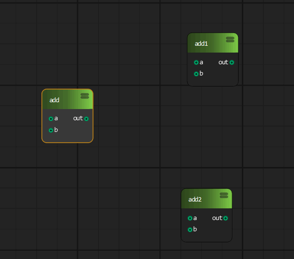
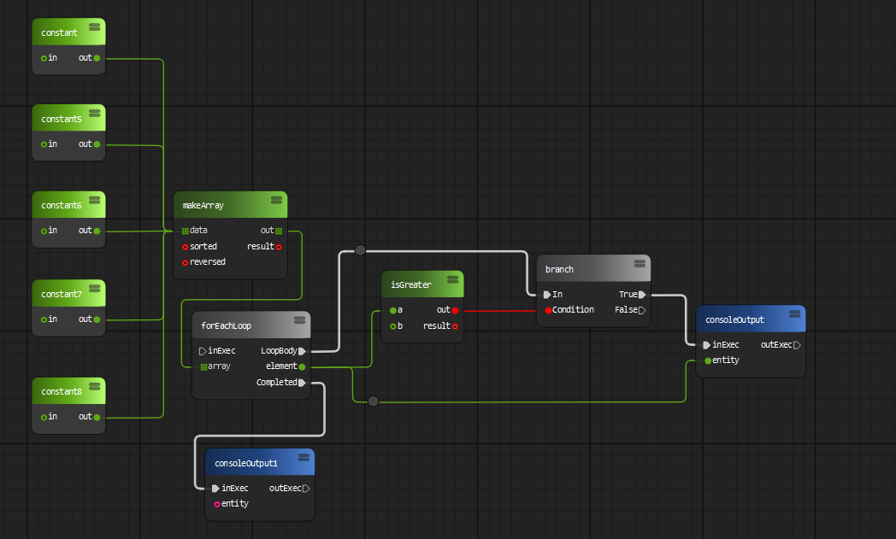
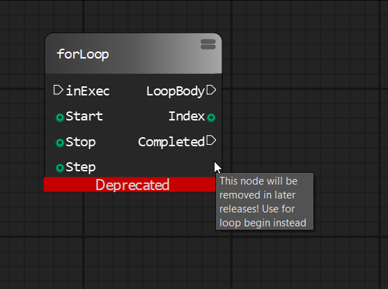
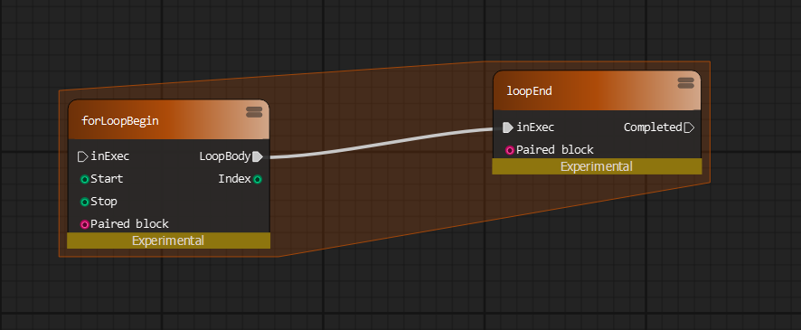

# Overview

**PyFlow** is a general purpose visual scripting framework for python.

<p align="center"></p>

## State

All base structure of program implemented, such things as packages discovery,
input customization, exporters, base classes for entities and tools.

You can completely remove nodes and tools that ships by default 
and start your own library from scratch.

You can evaluate programs without running user interface.

We have simple CLI interface and setup.py script.

We expectedly faced problems with our runtime evaluation model,
it is good for certain types of tasks even it is slow. Also, complicated flow
control requires cycles handling.

For example current for loop node implementation
doesn't work well with any kind of `delay` stuff in it's body. Of course it can be solved by adding
more logic to loop processing, but we don't know exactly how to make it efficient yet.

## Road map

We will stay general purpose, adding new types of graphs (undirected graphs, trees)
and algorithms to work with those structures.

Code generation is probably the future of PyFlow.

We are going to implement more building blocks.
**Functions** - which unlike subgraphs will have single definition and multiple
entry points across the program.
**Objects** - very important concept of programming in general, object will have own methods,
access levels and variables.
**Events and delegates** - similar to ue4.

Application presets and api for writing own presets. Templates like in any IDE (shader, command line tool, software installer, etc.).

Documentation updates.

User interface improvements and new tools to enhance user experience.

We want to have most python standard library wrapped into a nodes!

## Installation

### Manual

1. Clone or download repository.

2. Install requirements for your use case.

    requirement lists can be found under `PyFlow/requirements`

3. To run the program in standalone mode, run `pyflow.py`. It can be found in the root folder of repository.

### Or using pip

Latest development version. Contains latest features

```bash
pip install git+https://github.com/wonderworks-software/PyFlow.git@master
```

After package is installed, you can invoke `pyflow.exe` on windows or `pyflow` on unix OS.
Program is located inside `PATH/TO/PYTHON/Scripts`.

## Features overview

* **Modular**

    *Add own node sets, pins, shelf tools, dock tools, preferences widgets, data exporters/importers*

* **Easy integration**

    *PyFlow is a normal python program. It can run under any python environment*

* **Python3 and 2 support**
* **Logic and UI are separated**

    *Main logic elements (Node and Pin) has non gui representation, so programs can be evaluated without GUI*

* **Subgraphs**

    *Collapse parts of graphs into subgraphs*

    

* **Watch what is going on**

    

* **Expose properties from subgraphs**

    *Any node can share it's properties with owning sub graph node*

    

* **Subgraphs import/export**

    *Share subgraphs with others*

    

    *If compound node was exported to some package, it will appear in node box*

    

* **Python node**

    *Write whatever code directly into a node*

    

* **Python node import/export**

    *Share python nodes with others*

    

    *If python node was exported to some package, it will appear in node box*

    

* **Fast node generation from functions**

    *Single decorator to expose node from function*

    
    

* **Package loading from arbitrary locations**

    *Packages can be loaded from provided list of directories. It can be your development folder or folder in network drive inside your studio*

* **Graph commenting**
  * Comment node

    

  * Sticky node

    

* **Custom input system**

    *If you got used to specific keymap of your software of choice, you can easily remap PyFlow input actions*

    

* **Drop on wire**

    *Automatically сonnect the node by dragging it onto the wire*

    

* **Photoshop-like history**

    *Easy to use powerful undo system*

    

    *By a single line call*

    

* **Property view**

    *Modify node and pins attributes using property panels*

    

* **Variables**

    *Save arbitrary data into a variables*

    

* **Editable shareable themes**

    *Create and share themes with others*

    

* **Data importers/exporters**

    *Editor data can be exported/imported to/from arbitrary format*

* **Command line interface**

    

    *Exported programs can be edited and evaluated from command line without gui*

    
    

* **Convenient wires interaction**

  

* **Wire styles**

  

  

  

* **Node deprecation flag**

    *Tell users to update their programs*

    
    

* **Widgets library**
  * Sliders

    *Custom Houdini style sliders, value draggers, ramp widgets*

    

  * Properties framework

    *Custom widgets for property panels. Collapsible categegories, search field*

  * Input framework

    *Custom widgets for mouse, keyboard capture*

* **Plugin wizards framework**

    *Generate package template to start development. Or create own wizard for your module*

* **Easy configuration files framework**

    *While adding own modules you probably want to have some configuration data. We provide easy to use api for this*

And more..

## Getting Started

We have [documentation](https://pyflow.readthedocs.io/en/latest/)

## Contributing

See `CONTRIBUTING.md`

## Versioning

We use a [semantic versioning](http://semver.org/) policy.

## Authors

* **Ilgar Lunin** - [Ilgar Lunin](https://github.com/IlgarLunin)
* **Pedro Cabrera** - [Pedro Cabrera](https://github.com/pedroCabrera)

See also the list of [contributors](https://github.com/wonderworks-software/PyFlow/contributors) who participated in this project.

## Discussion

Join us to our [discord channel](https://discord.gg/SwmkqMj) and ask anything related to project!
