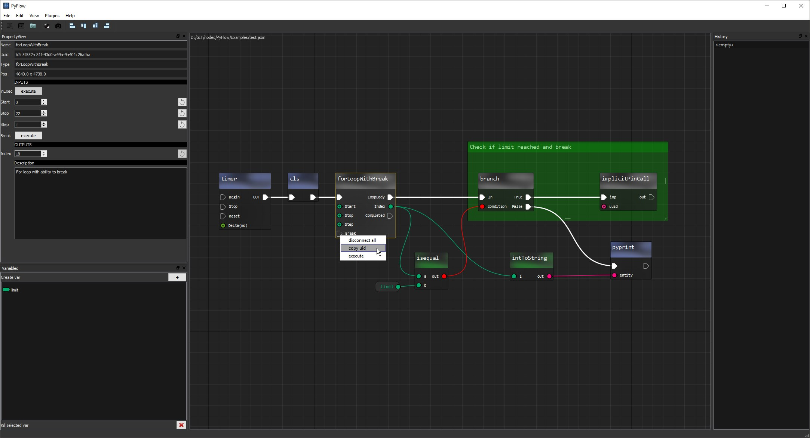

# Overview
<p align="center">
  
</p>

**PyFlow** is a general purpose runtime extendable python qt node editor.

# Table of contents
- [Features](#features)
- [Installation](#installation)
- [Pip dependencies](#dependencies)
- [Usage](#usage)
- [Licensing](#licensing)

# Features
- Json serializable
- Easy node creation from annotated functions
- Categories tree
- Undo stack
- Properties view
- Dirty propagation for optimal graph computation
- Runtime nodes creation
- Variables

# Installation
1. Download repository.
2. Install [conda](https://conda.io/miniconda.html) with pyside2 environment. [Instruction](https://fredrikaverpil.github.io/2017/08/28/pyside2-easy-install/) here
3. Go to **Scripts/** folder and install dependencies
	```bash
	pip install Qt.py pyrr enum34
	```
4. Execute **starter.bat**


# Dependencies
- [Qt.py](https://github.com/mottosso/Qt.py)
- PySide or PySide2 or PyQt5 or PyQt4
- [pyrr](https://github.com/adamlwgriffiths/Pyrr) for builtin math. (optional)

# Usage
App's entry point is a **PyFlow.py** file. There are also several handy bat scripts for debugging and profiling.
Right click on empty space to show node box then drag and drop on to canvas. Or press enter with node name selected.
Connect and execute pins from property view or using timer node.

# Extending
See source code. **FunctionLibraries** folder for annotated nodes, **Nodes** folder for
class based nodes. **Pins**, for data types and **Commands** for editor commands.

# Donate
[](https://paypal.me/ILunin)

# Licensing
The MIT License (MIT)

Copyright (c) 2015-2018 The PyFlow Authors

Permission is hereby granted, free of charge, to any person obtaining a copy
of this software and associated documentation files (the "Software"), to deal
in the Software without restriction, including without limitation the rights
to use, copy, modify, merge, publish, distribute, sublicense, and/or sell
copies of the Software, and to permit persons to whom the Software is
furnished to do so, subject to the following conditions:

The above copyright notice and this permission notice shall be included in
all copies or substantial portions of the Software.

THE SOFTWARE IS PROVIDED "AS IS", WITHOUT WARRANTY OF ANY KIND, EXPRESS OR
IMPLIED, INCLUDING BUT NOT LIMITED TO THE WARRANTIES OF MERCHANTABILITY,
FITNESS FOR A PARTICULAR PURPOSE AND NONINFRINGEMENT. IN NO EVENT SHALL THE
AUTHORS OR COPYRIGHT HOLDERS BE LIABLE FOR ANY CLAIM, DAMAGES OR OTHER
LIABILITY, WHETHER IN AN ACTION OF CONTRACT, TORT OR OTHERWISE, ARISING FROM,
OUT OF OR IN CONNECTION WITH THE SOFTWARE OR THE USE OR OTHER DEALINGS IN
THE SOFTWARE.
