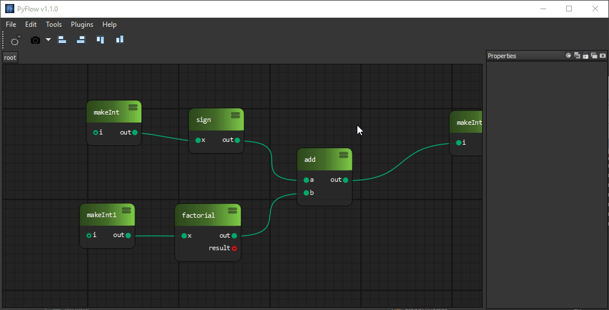
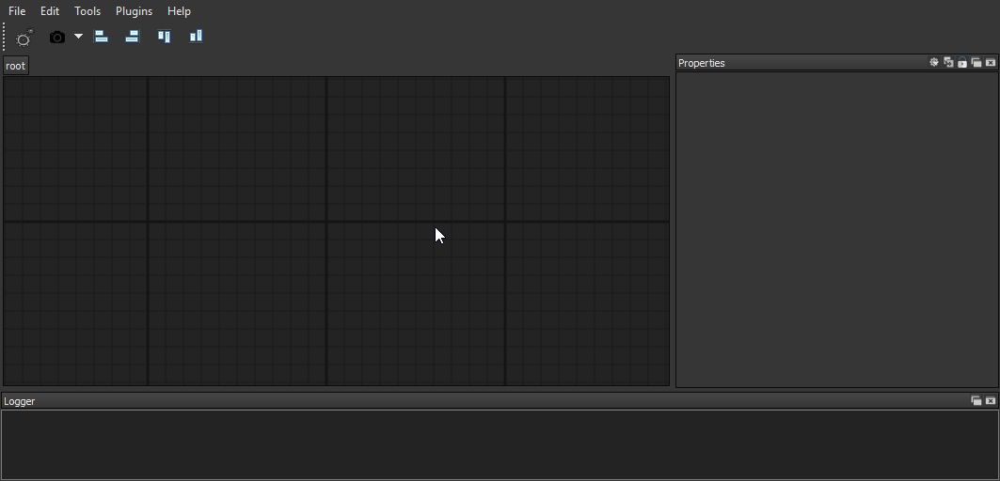
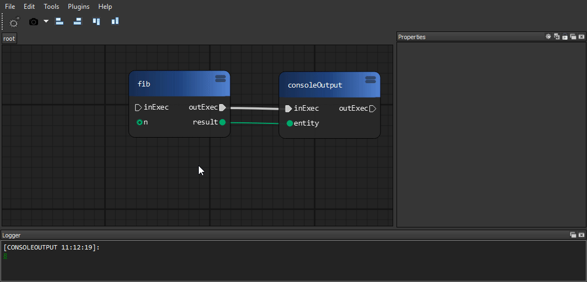
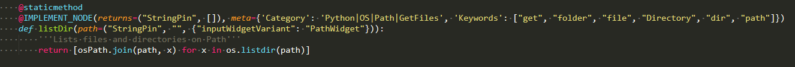
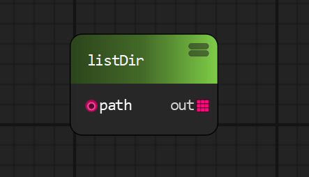
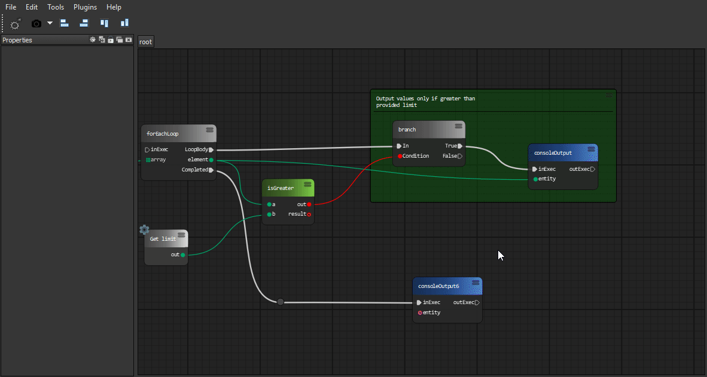
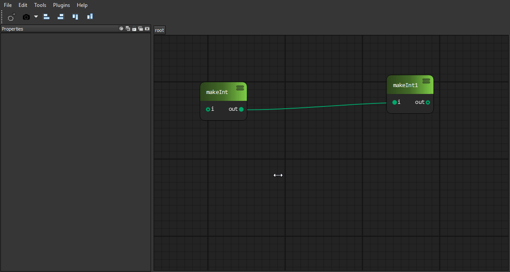
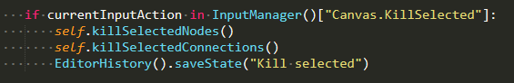
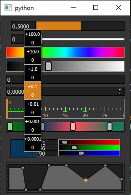

# Overview

**PyFlow** is a general purpose visual scripting framework for python.

<p align="center"></p>

## Installation

### Manual

1. Clone or download repository.

2. Install requirements for your use case.

    requirement lists can be found under `PyFlow/requirements`

3. To run the program in standalone mode, run `pyflow.py`. It can be found in the root folder of repository.

### Or using pip

Latest development version. Contains latest features

```bash
pip install git+https://github.com/wonderworks-software/PyFlow.git@master
```

After package is installed, you can invoke `pyflow.exe` on windows or `pyflow` on unix OS.
Program is located inside `PATH/TO/PYTHON/Scripts`.

## Features overview

* **Modular**

    *Add own node sets, pins, shelf tools, dock tools, preferences widgets, data exporters/importers*

* **Easy integration**

    *PyFlow is a normal python program. It can run under any python environment*

* **Python3 and 2 support**
* **Logic and UI is separated**

    *Main logic elements (Node and Pin) has non gui representation, so programs can be evaluated without GUI*

* **Subgraphs**

    *Collapse parts of graphs into subgraphs*

    

* **Subgraphs import/export**

    *Share subgraphs with others*

    

* **Python node**

    *Write whatever code directly into a node*

    

* **Python node import/export**

    *Share python nodes with others*

    

* **Fast node generation from functions**

    *Single decorator to expose node from function*

    
    

* **Package loading from arbitrary locations**

    *Packages can be loaded from provided list of directories. It can be your development folder or folder in network drive inside your studio*

* **Graph commenting**
  * Comment node

    

  * Sticky node

    

* **Custom input system**

    *If you got used to specific keymap of your software of choice, you can easily remap PyFlow input actions*

    

* **Drop on wire**

    *Automatically сonnect the node by dragging it onto the wire*

    

* **Photoshop-like history**

    *Easy to use powerful undo system*

    

    *By a single line call*

    

* **Property view**

    *Modify node and pins attributes using property panels*

    

* **Variables**

    *Save arbitrary data into a variables*

    

* **Editable shareable themes**

    *Create and share themes with others*

    

* **Data importers/exporters**

    *Editor data can be exported/imported to/from arbitrary format*

* **Convenient wires interaction**

  

* **Widgets library**
  * Sliders

    *Custom Houdini style sliders, value draggers, ramp widgets*

    

  * Properties framework

    *Custom widgets for property panels. Collapsible categegories, search field*

  * Input framework

    *Custom widgets for mouse, keyboard capture*

* **Plugin wizards framework**

    *Generate package template to start development. Or create own wizard for your module*

* **Easy configuration files framework**

    *While adding own modules you probably want to have some configuration data. We provide easy to use api for this*

And more..

## Getting Started

We have [documentation](https://pyflow.readthedocs.io/en/latest/)

## Contributing

See `CONTRIBUTING.md`

## Versioning

We use a [semantic versioning](http://semver.org/) policy.

## Authors

* **Ilgar Lunin** - [Ilgar Lunin](https://github.com/IlgarLunin)
* **Pedro Cabrera** - [Pedro Cabrera](https://github.com/pedroCabrera)

See also the list of [contributors](https://github.com/wonderworks-software/PyFlow/contributors) who participated in this project.

## Discussion

Join us to our [discord channel](https://discord.gg/SwmkqMj) and ask anything related to project!
