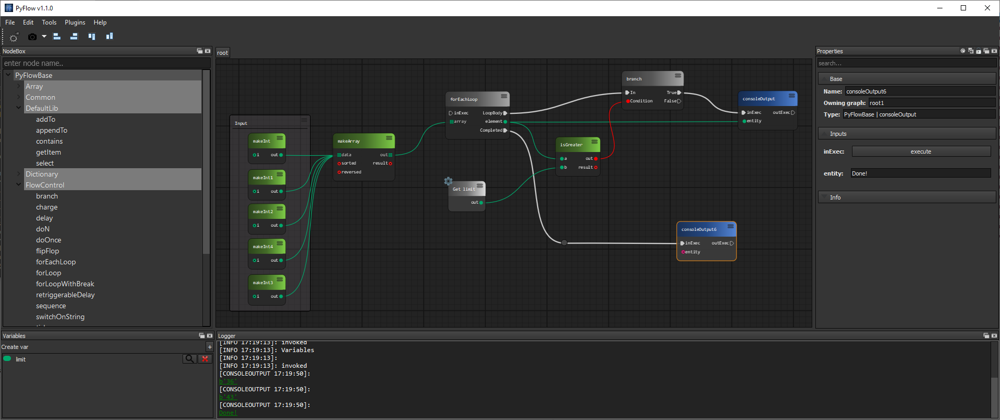

# Overview

**PyFlow** is a general purpose visual scripting framework for python.

## Installation

1. Clone or download repository.

2. Install requirements for you use case.

    requirement lists can be found under `PyFlow/requirements`

3. To run the program in standalone mode, run `launcher.py`. It can be found in the root folder of repository.

## Features overview

* Modular
* Easy integration
* Subgraphs
* Subgraphs import/export
* Python node
* Python node import/export
* Fast node generation from functions
* Graph commenting
  * Comment node
  * Sticky node
* Custom input system
* Drop on edge
* Photoshop-like history
* Property view
* Variables
* Editable shareable themes
* Data importers/exporters
* Convenient wires interaction
  * Tear off
  * Reconnect
* Widgets library
  * Sliders
  * Properties framework
  * Input framework
* Plugin wizards framework
* Easy configuration files framework

## Getting Started

We have [documentation](https://pyflow.readthedocs.io/en/latest/)

## Contributing

See `CONTRIBUTING.md`

## Versioning

We use a [semantic versioning](http://semver.org/) policy.

## Authors

* **Ilgar Lunin** - [Ilgar Lunin](https://github.com/IlgarLunin)
* **Pedro Cabrera** - [Pedro Cabrera](https://github.com/pedroCabrera)

See also the list of [contributors](https://github.com/wonderworks-software/PyFlow/contributors) who participated in this project.

## Discussion
[Discord channel](https://discord.gg/SwmkqMj)
