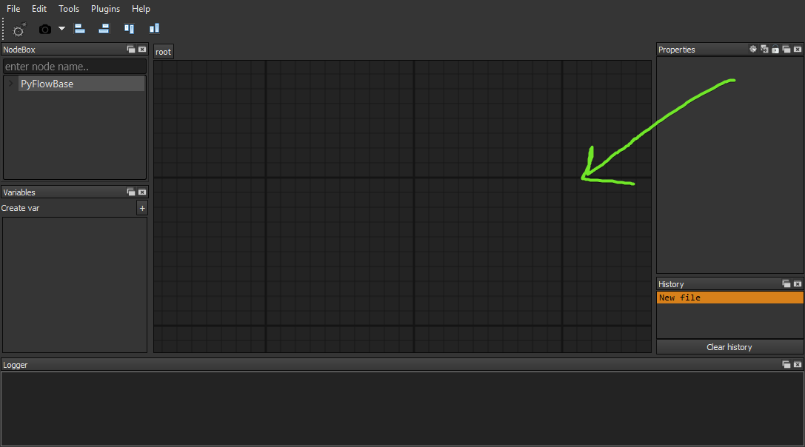
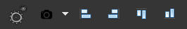
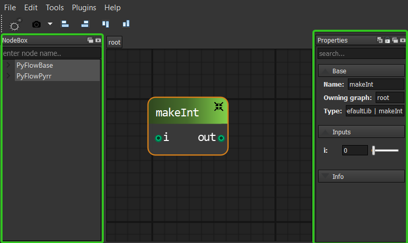
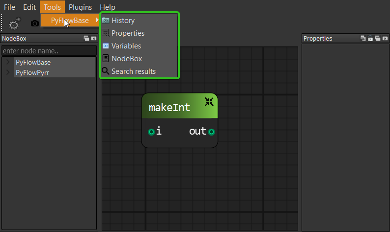
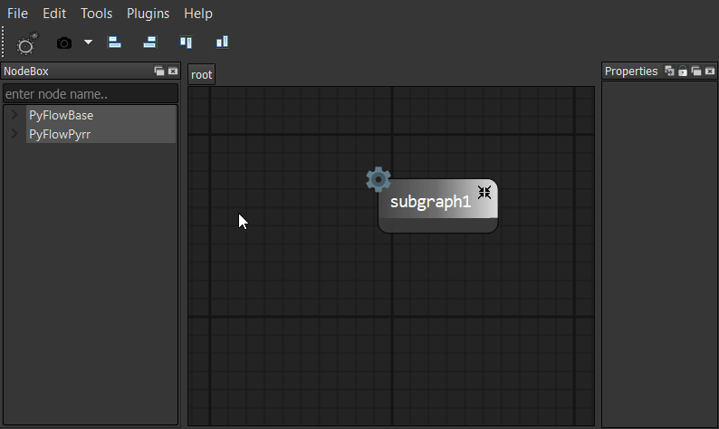
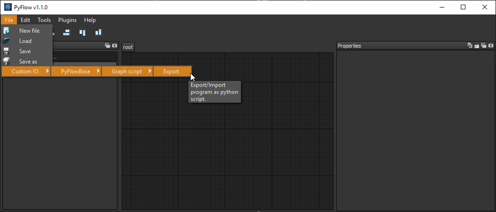

Editor anatomy
==============

In the middle of the app there is a :class:`Canvas <PyFlow.UI.Canvas.Canvas.Canvas>`. This is where the fun happens.

Everything in editor except of canvas is a :class:`tool <PyFlow.UI.Tool.Tool.ToolBase>`. There are two types of tools

Shelf tool
**********
:class:`Shelf tools <PyFlow.UI.Tool.Tool.ShelfTool>` are located on the toolbar of editor main window.

Dock tool
*********
:class:`Dock tools <PyFlow.UI.Tool.Tool.DockTool>` are floating widgets.

All registered dock tools can be found below corresponding section on menu bar.

Subgraphs navigation
********************

On the top of canvas there is a :meth:`current location <PyFlow.Core.GraphBase.GraphBase.location>` widget. To step into subgraph - double click
on compound node. To step up - click on any parent button.

Exporter
********

Under `file->Custom IO` you can find all registered exporters and importers

