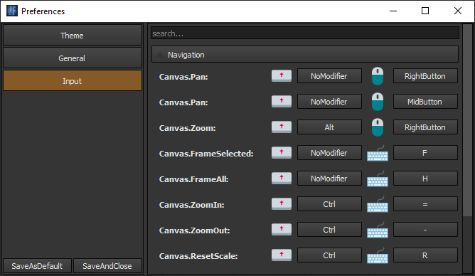

Navigation
==========

To pan - use **middle mouse button** or **Alt + left mouse button**.
To zoom - use **right mouse button**. This is default mapping, however,
editor has it's own input manager and most of the input can
be remapped via properties window.

Adding node to canvas
=====================

To add node to a canvas, you need either to spawn NodeBox tool
or right click on canvas. Node box will appear. Enter node type to
search field and drag it to the canvas.

.. image:: resources/add_node.gif
