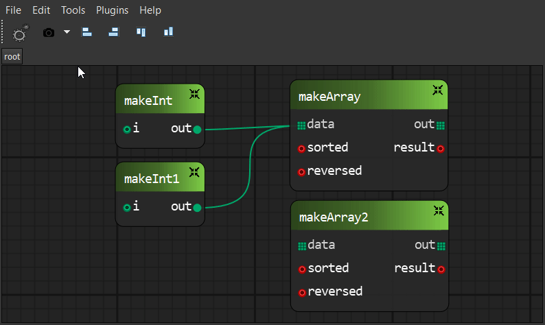

Navigation
==========

To pan - use **middle mouse button** or **Alt + left mouse button**.
To zoom - use **right mouse button**. This is default mapping, however,
editor has it's own input manager and most of the input can
be remapped via properties window.

.. image:: resources/input_prefs.png

Adding node to canvas
=====================

To add node to a canvas, you need either to spawn NodeBox tool
or right click on canvas. Node box will appear. Enter node type to
search field and drag it to the canvas.

.. image:: resources/add_node.gif

Connecting pins
===============

To connect pins, left mouse click source pin and drag to destination. Dashed
wire will appear. Valid connections color coded as `green`, invalid as `red`. Wire is
snapped to destination pin if connectoin is possible.

.. image:: resources/connect_pins.gif

Wires can be reconnected. To reconnect a single wire,
click on it near the pin and drag on top of new destination. To reconnect multiple wires,
:kbd:`Ctrl+LMB` on pin, then drag on top of new destination.

