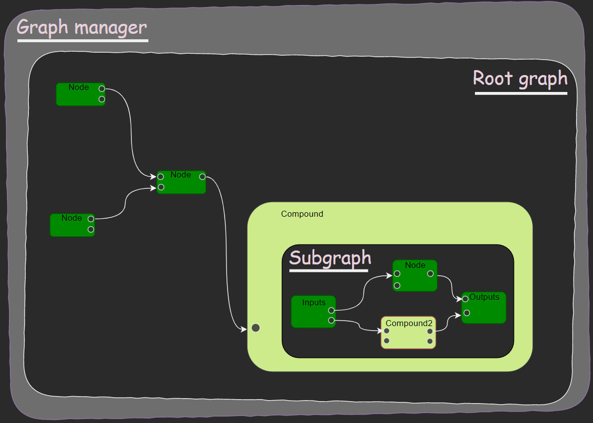

Data layout
===========

Top level object is :class:`GraphManager <PyFlow.Core.GraphManager.GraphManager>`.
Graph manager contains :class:`graphs <PyFlow.Core.GraphBase.GraphBase>`.
Graphs contains :class:`nodes <PyFlow.Core.NodeBase.NodeBase>`.
Nodes contains :class:`pins <PyFlow.Core.PinBase.PinBase>`.

.. seealso:: :class:`~PyFlow.Packages.PyFlowBase.Nodes.compound.compound`
